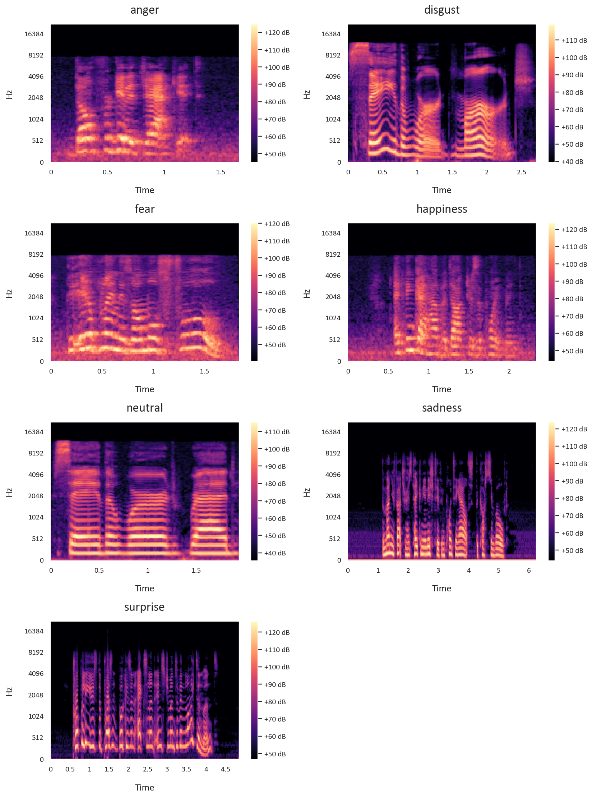

# Speech Emotion Recognition (SER) using CNNs and CRNNs Based on Mel Spectrograms and Mel Frequency Cepstral Coefficients (MFCCs).

## Overview

Recognizing emotions from voice alone is a challenging task. Emotions are subjective and not universal, and we often rely on facial expressions and body language to recognize emotions, so relying on voice alone is difficult. Despite these challenges, this project aims to build a model that can accurately classify the emotional content of vocal expressions.

## Datasets

Four datasets are used in this project:

1. [RAVDESS](https://zenodo.org/record/1188976#.X2Q4Z2gzZPY)
2. [TESS](https://tspace.library.utoronto.ca/handle/1807/24487)
3. [SAVEE](http://kahlan.eps.surrey.ac.uk/savee/)
4. [CREMA-D](https://github.com/CheyneyComputerScience/CREMA-D)

## Models

Three different models are used to classify the emotions:

1. A Convolutional Neural Network (CNN) trained on the Mel Spectrograms of the audio files. Mel Spectrograms look like this:
   


3. A CNN trained on the Mel Frequency Cepstral Coefficients (MFCCs) of the audio files.
4. A Convolutional Recurrent Neural Network (CRNN) trained on the Mel Frequency Cepstral Coefficients of the audio files.

## Contents

The project is organized as follows:

1. Data Collection
2. Data Wrangling
3. Data Exploration, Preparation, and Visualization
4. Data Preprocessing
5.1 Mel Spectrogram CNN Model
5.2 MFCCs CNN Model
5.3 MFCCs CRNN Model

Each of these sections is contained in the Jupyter notebook `speech_emotion_recognition.ipynb`.

## Findings

After training and testing the three models, we found that:

1. The CNN model trained on Mel Spectrograms performed well, but had some difficulty distinguishing between certain emotions.
2. The CNN model trained on MFCCs showed the best performance among all three models, indicating that MFCCs may be a more effective representation for this task.
3. The CRNN model trained on MFCCs also performed well, but it did not outperform the CNN model trained on MFCCs and tended to overfit.

## Evaluation

We evaluated the models using Precision, Recall, and the F1 score. These metrics provide a more comprehensive view of model performance than accuracy alone, as they take into account both false positives and false negatives. The CNN model trained on MFCCs achieved the highest scores on these metrics, further confirming its superior performance.

These are the scores for each model:

1. The CNN model trained on Mel Spectrograms achieved an accuracy of 71%, with a macro average F1-score of 0.73.
2. The CNN model trained on MFCCs showed the best performance among all three models, achieving an accuracy of 74%, with a macro average F1-score of 0.76.
3. The CRNN model trained on MFCCs also performed well, achieving an accuracy of 74%, with a macro average F1-score of 0.75.


Here are the detailed scores for each model:

**Mel Spectrogram Model**
```
              precision    recall  f1-score   support
       anger       0.75      0.77      0.76       390
     disgust       0.67      0.67      0.67       369
        fear       0.69      0.65      0.67       378
   happiness       0.68      0.63      0.65       396
     neutral       0.70      0.80      0.75       326
     sadness       0.70      0.72      0.71       396
    surprise       0.92      0.88      0.90       139
```

**MFCCs CNN Model**
```
              precision    recall  f1-score   support
       anger       0.80      0.82      0.81       390
     disgust       0.71      0.71      0.71       369
        fear       0.70      0.66      0.68       378
   happiness       0.73      0.69      0.71       396
     neutral       0.75      0.77      0.76       326
     sadness       0.70      0.75      0.73       396
    surprise       0.93      0.92      0.93       139
```

**MFCCs CRNN Model**
```
              precision    recall  f1-score   support
       anger       0.81      0.81      0.81       390
     disgust       0.71      0.70      0.70       369
        fear       0.70      0.66      0.68       378
   happiness       0.72      0.68      0.70       396
     neutral       0.75      0.75      0.75       326
     sadness       0.68      0.75      0.71       396
    surprise       0.91      0.91      0.91       139
```


Future work could involve experimenting with more complex model architectures, collecting more training data, and refining the preprocessing techniques to improve the models' ability to distinguish between similar emotions.

Please note that the actual performance of the models may vary depending on the specific dataset used, the preprocessing techniques applied, and the parameters chosen for the models.

## Usage

To run the code in this repository, you will need to have Python installed, along with the libraries listed in `requirements.txt`. You can install these with pip using the command `pip install -r requirements.txt`.

Once the dependencies are installed, you can open the notebook `speech_emotion_recognition.ipynb` in Jupyter and run the cells to execute the code.

## License

This project is licensed under the terms of the MIT license.
